# Soccer Game Result Prediction

The idea of this project is to predict who wins the game with half'time as the prediction time point. 
Therefore, this is a multiclass classification problem in which we can have Home win, Away win and Draw as results.
This problem is approached as a time-series problem, meaning that the time of occurrence of the event is meaningful for our prediction (we forecast the future with past results). 

## Data
I created the whole database from different datasets that I have found online: 
1. From https://www.football-data.co.uk/ I gathered the results and betting odds from the most famous betting companies since the 1994/95 season.
2. From https://www.kaggle.com/shubhmamp/english-premier-league-match-data I was able to find the lineups and match stats for every game in between 2014 to 2018.
3. From https://www.kaggle.com/stefanoleone992/fifa-20-complete-player-dataset I found the attributes of all the players from the game FIFA since 2014.

The key idea of my proposed solution is to see whether the players rating on the video game Fifa have an impact on the results.

Every data set I gather had a very different structure, and even different names for the same clubs/players that were all solved with the library FuzzyWuzzy (which uses the Levenshtein distance to match strings). All the data wrangling to create the database is in the file 'createDB.py' 

These are the results we have for all the seasons:

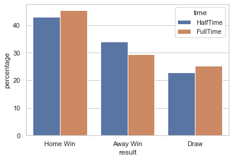

As we see, the results change a little after half time, being more inclined towards a draw or a home win rather than an away win. These changes are the important ones, and the ones that will give you the money on bets.
For the most part however, the result won't change after halftime:

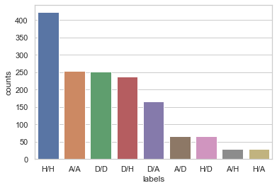

## Modeling

Now that the database is ready for its use it is time to start with modeling. Since the games occur weekly, I decided to approach the problem as a time-series problem where I try to predict the final result based on all the information I gathered at half time.
The Machine Learning algorithms that I used to forecast the full time result are Gradient Boosting Machine and Elastic Net; a linear algorithm and a tree based algorithm in case the data does not follow a linear structure.

I used a linear regression as a baseline model to see how the results improve when implementing the players data or using hyperparameter tuning with the algorithms.

#### Baseline model
For the baseline model I used a simple linear regression and checked the results using only the historical results (FT and HT), then adding the betting odds, and finally adding the lineups and players' ratings.

1. Using only historical results:

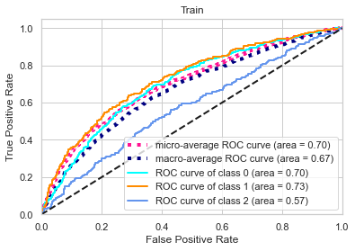
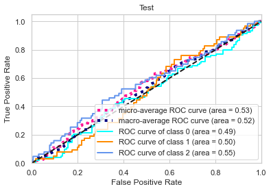

2. Adding the betting odds:

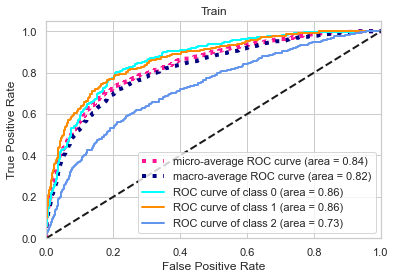
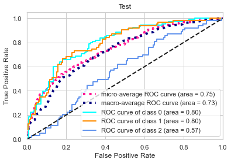

3. Adding players' ratings:

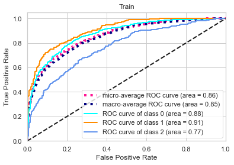
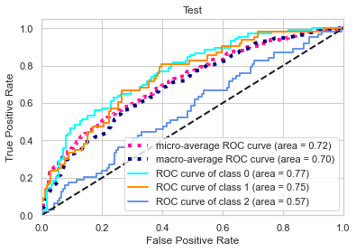

As the images show, adding more information improves the AUC in both train and test, so this can tell us we are on the right path. Let's see how the more complex models perform.

#### Time-Series Cross Validation
It is now time to start training and tuning more complex models, for that I need to use a validation set to check which ones are the best hyperparameters for each model. 

The problem with time-series is that the models have to be trained with past data and tested with data from the future. This means it is not correct to simply use a GridSearchCV where the training and validation samples are taken randomly. For this reason I have to use a different solution for the tuning, a [Nested Cross-Validation](https://towardsdatascience.com/time-series-nested-cross-validation-76adba623eb9):

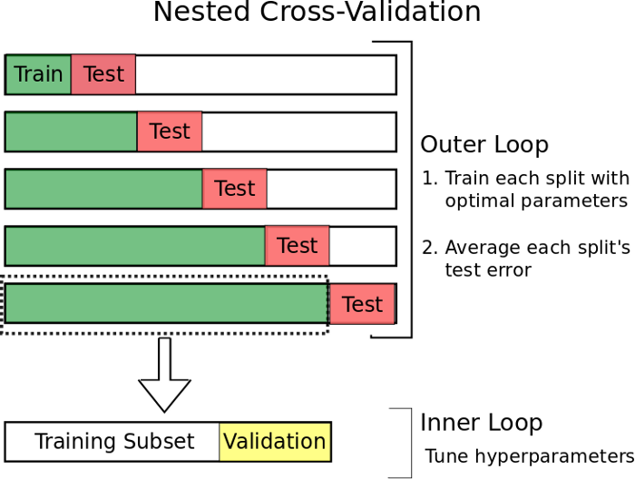

Since I am training and tuning 3 different algorithms and this project is a proof of concept for time-series forecasting, I do not really need to tune to perfection, so I am going to create a [RandomSearch](https://machinelearningmastery.com/hyperparameter-optimization-with-random-search-and-grid-search/) Cross Validation from scratch, trying to get a pseudo-optimal combination of hyperparameters for my algorithms in a much quicker approach than using a grid search.

## Results
Time to show the results and see how they compare with the baseline approach:

1) ElasticNet: a linear regression like the baseline model adding regularization and hyperparameter tuning.

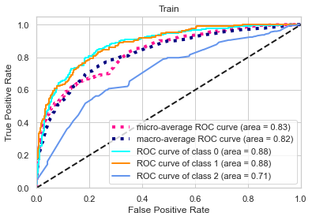
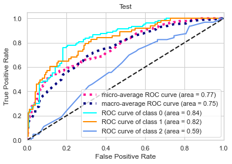

2) GBM: a tree based algorithm that tries to improve the error with every iteration.

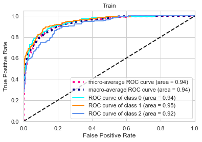
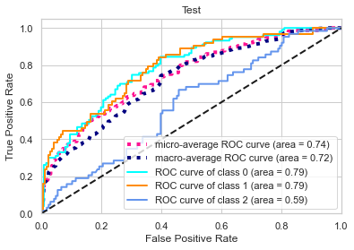

Using the average between micro and macro AUC results, this is how the forecasting improves with each model and data:

<table>
<thead>
	<tr>
		<th>Model</th>
		<th>Train Micro</th>
		<th>Train Macro</th>
		<th>Improvement Train</th>
		<th>Test Micro</th>
		<th>Test Macro</th>
		<th>Improvement Test</th>
	</tr>
</thead>
<tbody>
	<tr>
		<td>Baseline</td>
		<td>0.7</td>
		<td>0.67</td>
		<td>0.0%</td>
		<td>0.53</td>
		<td>0.52</td>
		<td>0.0%</td>
	</tr>
	<tr>
		<td>Baseline Betting Odds</td>
		<td>0.84</td>
		<td>0.82</td>
		<td>21.2%</td>
		<td>0.75</td>
		<td>0.73</td>
		<td>41.0%</td>
	</tr>
	<tr>
		<td>Baseline Players</td>
		<td>0.86</td>
		<td>0.85</td>
		<td>24.8%</td>
		<td>0.72</td>
		<td>0.7</td>
		<td>35.2%</td>
	</tr>
	<tr>
		<td>Elastic Net</td>
		<td>0.83</td>
		<td>0.82</td>
		<td>20.4%</td>
		<td>0.77</td>
		<td>0.75</td>
		<td>44.8%</td>
	</tr>
	<tr>
		<td>Gradient Boosting Machine</td>
		<td>0.94</td>
		<td>0.94</td>
		<td>37.2%</td>
		<td>0.74</td>
		<td>0.72</td>
		<td>39.0%</td>
	</tr>
</tbody>
</table>

As the table shows, the Elastic Net shows the largest improvement compared to the baseline model, by almost 45%. However, the GBM is the model that improves the most with the train set, this could tell us that getting a larger data-set the GBM might be a much better option.

# Conclusion

Using Time-Series forecasting along with adding external data and hyperparameter tuning, the **results** of the forecasting **have improved by 44.8% in the test set**.
